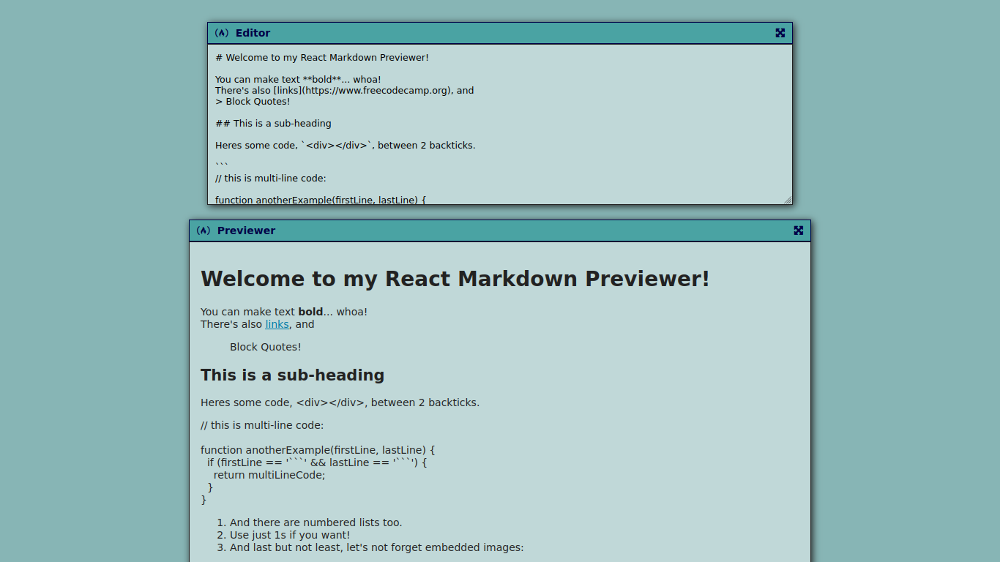
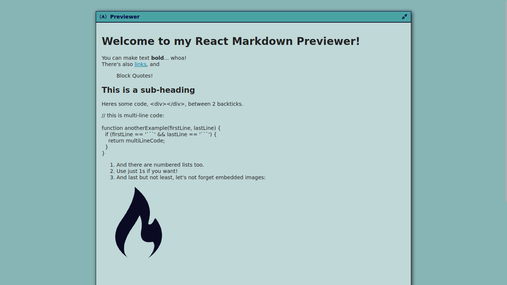

# Pré-visualizador de markdown

Um pré-visualizador de markdown é apresentado nesta aplicação. Este projeto foi desenvolvido para obter a certificação em Bibliotecas de Desenvolvimento Front-End na plataforma freeCodeCamp.

##  :gear: Tecnologias

- HTML
- CSS
- JavaScript
- React

##  :art: Layout

